# Video Harness — Architecture

> **Cursor for video editing.** An agent-native harness where AI edits structured plans, deterministic tools render pixels, and every step is verifiable.

---

## Table of contents

1. [Design principle](#1-design-principle)
2. [System overview](#2-system-overview)
3. [The Cursor analogy](#3-the-cursor-analogy)
4. [Architecture layers](#4-architecture-layers)
5. [Data flow](#5-data-flow)
6. [Project structure](#6-project-structure)
7. [Artifact schemas](#7-artifact-schemas)
8. [Media index](#8-media-index)
9. [Plan layer — EDL & storyboard](#9-plan-layer--edl--storyboard)
10. [Validation engine](#10-validation-engine)
11. [Execution layer](#11-execution-layer)
12. [QA & verification](#12-qa--verification)
13. [Context system](#13-context-system)
14. [Agent orchestration](#14-agent-orchestration)
15. [Approval gates](#15-approval-gates)
16. [Studio UI](#16-studio-ui)
17. [Technology stack](#17-technology-stack)
18. [Repository layout](#18-repository-layout)
19. [Build phases](#19-build-phases)
20. [Integration map — HyperFrames & existing skills](#20-integration-map--hyperframes--existing-skills)
21. [Strong vs weak harness](#21-strong-vs-weak-harness)
22. [Limits & future extensions](#22-limits--future-extensions)
23. [Glossary](#23-glossary)

---

## 1. Design principle

### The one rule

```
┌─────────────────────────────────────────────────────────────────┐
│                                                                 │
│   LLM edits PLANS          Tools render PIXELS                  │
│                                                                 │
│   BRIEF.md                 FFmpeg                             │
│   edit-plan.json      →    HyperFrames render                 │
│   STORYBOARD.md            Generated shell scripts            │
│   composition HTML                                              │
│                                                                 │
└─────────────────────────────────────────────────────────────────┘
```

The model almost never reasons about raw video bytes. It reads **metadata, transcripts, keyframes, and timeline JSON**, proposes a **small diff**, and deterministic executors compile that diff into output.

This is the same split Cursor uses:

| Cursor | Video harness |
|--------|---------------|
| Understand codebase | Read media index + plan |
| Propose patch | Propose EDL / storyboard diff |
| Compiler produces binary | FFmpeg / HyperFrames produces MP4 |
| Lint + typecheck | EDL validator + snapshot QA |

### What this optimizes for

| Goal | Supported |
|------|-----------|
| Agent-native editing with maximum control | ✅ Primary |
| Reproducible, git-friendly projects | ✅ Primary |
| Marketing / social / explainer deliverables | ✅ Primary |
| Motion graphics + assembly hybrid workflows | ✅ Primary |
| Real-time interactive NLE feel | ❌ Out of scope (batch-compile model) |
| Pure generative video from text | ❌ Different problem (Sora/Runway lane) |
| Long-form documentary aesthetic nuance | ⚠️ Partial — human preview still needed for last 10% |

---

## 2. System overview

### High-level component map

```mermaid
flowchart TB
  subgraph human["Human"]
    User((Editor / Creator))
  end

  subgraph studio["Studio — optional UI"]
    UI[Timeline · EDL table · Contact sheet · Diff view]
  end

  subgraph harness["Harness — TypeScript spine"]
    Router[Workflow router]
    Context[Context resolver]
    Validator[Validation engine]
    Dispatch[Agent dispatcher]
    RenderGen[Render generator]
  end

  subgraph ai["AI — any model, wired in"]
    Director[Director agent]
    Workers[Specialist workers]
  end

  subgraph artifacts["Project artifacts — source of truth"]
    Brief[BRIEF.md]
    Plan[edit-plan.json / STORYBOARD.md]
    Index[media-index.json]
    Scripts[scripts/render.sh]
  end

  subgraph indexers["Indexers — deterministic"]
    FFprobe[ffprobe]
    Scene[scene detect]
    Whisper[transcription]
    Embed[semantic embeddings]
  end

  subgraph executors["Executors — deterministic"]
    FFmpeg[FFmpeg filtergraph]
    HF[HyperFrames CLI]
    AudioMix[audio mix / ducking]
  end

  subgraph qa["QA — deterministic + selective multimodal"]
    Lint[structural checks]
    Snap[snapshot contact sheet]
    Loud[loudness analysis]
    MML[multimodal cut review]
  end

  User <-->|approve gates| UI
  UI <--> harness
  harness <--> artifacts
  harness --> Router
  Router --> Director
  Director --> Workers
  Workers --> artifacts
  indexers --> Index
  Plan --> Validator
  Validator -->|pass| RenderGen
  RenderGen --> Scripts
  Scripts --> executors
  executors --> qa
  qa -->|repair context| Director
  Context -->|@mentions| Director
  Index --> Context
```

### Layer stack

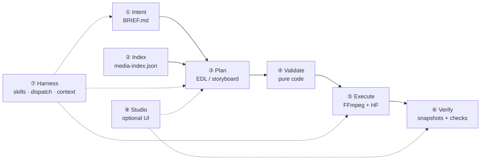

---

## 3. The Cursor analogy

### Side-by-side mapping

| Cursor IDE concept | Video harness equivalent | Artifact / tool |
|--------------------|--------------------------|-----------------|
| Workspace | Project folder | `my-ad/` |
| File tree | Asset catalog | `media-index.json` |
| Open files | Loaded plan + brief | `edit-plan.json`, `BRIEF.md` |
| LSP / types | Probe metadata + word timings | ffprobe, Whisper output |
| Symbol search | Semantic clip search | CLIP embeddings on index |
| `@file` mention | `@clip:hook`, `@asset:lake` | Context resolver |
| Inline diff | EDL diff | `{ hook.out: 3 → 3.5 }` |
| Accept / reject | Approval gates | G1–G4 (see §15) |
| Compiler | Render pipeline | FFmpeg + HyperFrames |
| Diagnostics | Validation errors | `qa/validation.json` |
| Tests | Snapshot + loudness QA | `qa/snapshots/` |
| Rules / skills | Editorial constraints | purpose tags, pacing rules |
| Agent mode | Director + workers | dispatch contract |
| Git | Project folder is git-friendly | plain text + JSON plans |

### Why this beats "ChatGPT + FFmpeg"

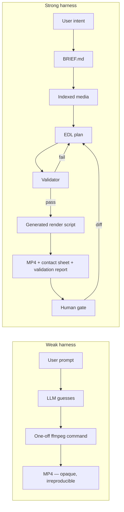

---

## 4. Architecture layers

### Layer ① — Intent

**Purpose:** Lock what we're making before any pixels move.

**Artifact:** `BRIEF.md` — human-readable, machine-parseable frontmatter + narrative sections.

**Blocks:** Planning until `status: approved`.

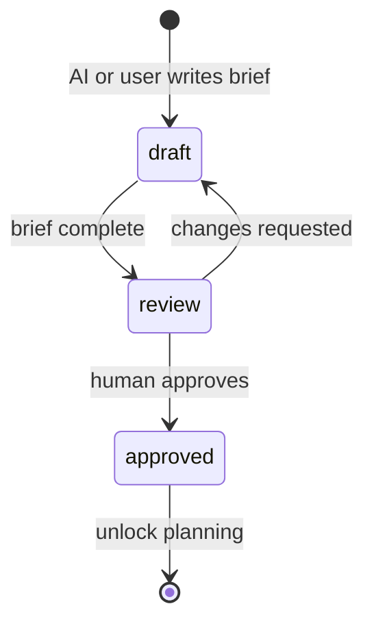

**Key fields:**

| Field | Example | Drives |
|-------|---------|--------|
| `route` | `assembly` · `motion` · `recut` · `music-sync` | Which plan format |
| `platform` | `tiktok` · `youtube` · `linkedin` | Duration + aspect rules |
| `aspect` | `9:16` · `16:9` · `1:1` | Scale/crop in render |
| `maxDurationSec` | `15` | Hard validator cap |
| `musicLeads` | `false` | VO-led vs beat-led edit |
| `flow` | `automation` · `companion` | Agent autonomy level |
| `storyboard` | `yes` · `no` | Review loop depth |

---

### Layer ② — Media index

**Purpose:** The "codebase index" — structured, queryable knowledge about every asset.

**Artifact:** `media-index.json`

**Built by:** deterministic ingest pipeline (no LLM).

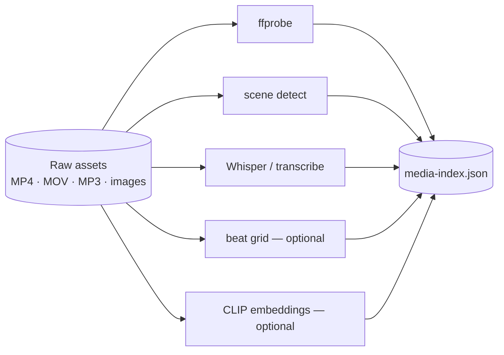

See [§8 Media index](#8-media-index) for full schema.

---

### Layer ③ — Plan

**Purpose:** The AI's actual edit surface — not pixels, not ffmpeg strings.

**Two plan formats by route:**

| Route | Plan artifact | Render target |
|-------|---------------|---------------|
| Assembly (stock + VO + footage) | `edit-plan.json` | FFmpeg filtergraph |
| Motion / explainer | `STORYBOARD.md` + `compositions/` | HyperFrames render |
| Hybrid | Both — HF render imported as EDL clip | FFmpeg assembly |

See [§9 Plan layer](#9-plan-layer--edl--storyboard).

---

### Layer ④ — Validation

**Purpose:** Compile-time errors for video. Pure TypeScript — no LLM judgment.

**Artifact:** `qa/validation.json`

**Blocks:** Render until `pass: true`.

Categories: structural · duration · editorial · audio · platform · paths.

See [§10 Validation engine](#10-validation-engine).

---

### Layer ⑤ — Execution

**Purpose:** Deterministic compile from approved plan to media files.

**Artifacts:**
- `scripts/render.sh` (generated, checked in)
- `renders/draft-vN.mp4`

**Rule:** AI never hand-writes one-off FFmpeg. Harness generates scripts from EDL.

See [§11 Execution layer](#11-execution-layer).

---

### Layer ⑥ — Verification

**Purpose:** Automated tests for video + selective multimodal review.

**Artifacts:**
- `qa/snapshots/*.jpg` — keyframes at EDL boundaries
- `qa/contact-sheet.jpg` — stitched overview
- `qa/validation.json` — pass/fail + reasons

See [§12 QA & verification](#12-qa--verification).

---

### Layer ⑦ — Harness

**Purpose:** Wire any AI in — skills, dispatch, context, gates.

**Components:**
- Workflow router (assembly vs motion vs recut)
- Context resolver (`@clip`, `@asset` mentions)
- Agent dispatcher (parallel workers, artifact-based completion)
- Skill loader (progressive disclosure — pacing rules, platform caps)

See [§13 Context system](#13-context-system) and [§14 Agent orchestration](#14-agent-orchestration).

---

### Layer ⑧ — Studio UI (optional)

**Purpose:** IDE surface — timeline, EDL diff, contact sheet, approve buttons.

The harness works headless (CLI + files). Studio makes it feel like Cursor.

See [§16 Studio UI](#16-studio-ui).

---

## 5. Data flow

### End-to-end sequence

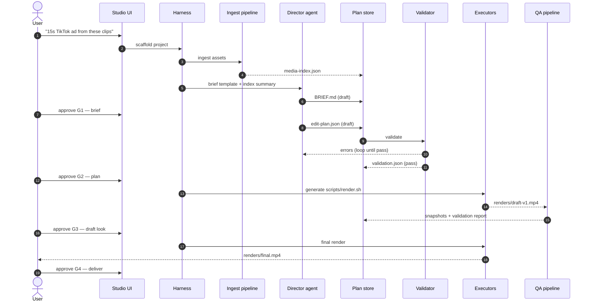

### Iteration loop (diff, not restart)

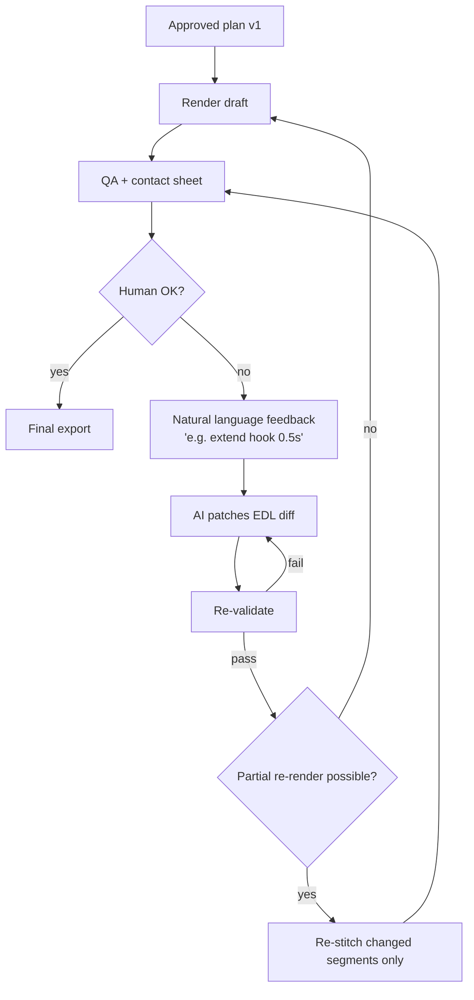

---

## 6. Project structure

### Per-project layout (assembly route)

```
my-tiktok-ad/
├── BRIEF.md                      # ① intent — human-approved
├── edit-plan.json                # ③ timeline source of truth
├── media-index.json              # ② asset catalog
│
├── transcripts/                  # word-level timing
│   └── vo-hook.srt
│
├── scripts/                      # ⑤ generated, reproducible
│   └── render.sh
│
├── qa/                           # ⑥ verification output
│   ├── validation.json
│   └── snapshots/
│       ├── 00-hook-start.jpg
│       ├── 01-hook-end.jpg
│       ├── 02-broll-mid.jpg
│       └── contact-sheet.jpg
│
├── tmp/                          # intermediates (gitignored)
│
└── renders/
    ├── draft-v1.mp4
    └── final.mp4
```

**Hand-authored:** 3–5 files · **Generated per render:** 5–15 files · **Folders:** 6–8

### Per-project layout (motion + assembly hybrid)

```
my-explainer/
├── BRIEF.md
├── STORYBOARD.md                 # scene plan for HyperFrames
├── edit-plan.json                # assembly of HF renders + stock
├── media-index.json
├── hyperframes.json
│
├── compositions/
│   ├── index.html                # master timeline
│   └── frames/
│       ├── 01-hook.html
│       ├── 02-problem.html
│       └── 03-cta.html
│
├── assets/                       # VO, music, images (project-local)
├── audio_meta.json               # word timings from ingest
├── scripts/
├── qa/
└── renders/
```

**Files:** 25–50+ (scales with scene count) · **Folders:** 10–15

### Project as unit of truth

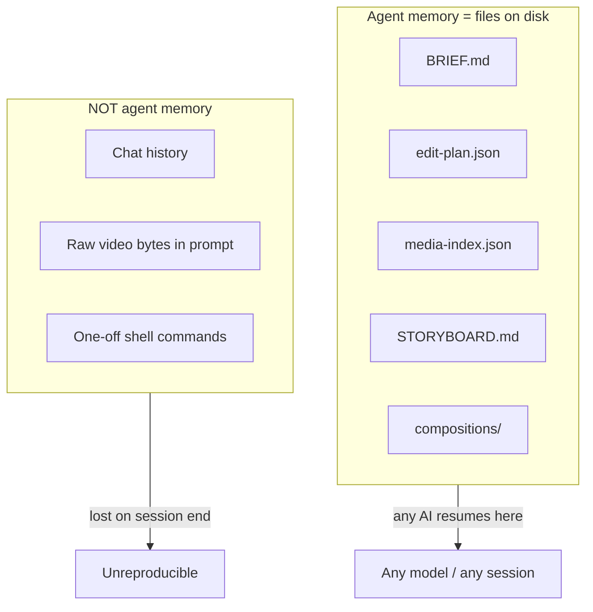

---

## 7. Artifact schemas

### BRIEF.md

```yaml
---
project: prayer-lock-social
status: approved                    # draft | review | approved
route: assembly                     # assembly | motion | recut | music-sync
platform: tiktok
aspect: "9:16"
maxDurationSec: 15
tone: urgent-but-warm
musicLeads: false
storyboard: no
flow: automation                    # automation | companion
---

## Goal

Drive app installs with a pattern-interrupt hook, emotional pause, and CTA.

## Must-haves

- Hook lands within first 2 seconds
- Product shot visible by 6 seconds
- CTA in final 3 seconds

## Assets supplied

- animation/prayer-lock-ad/renders/video.mp4
- videos/stock/nature-lake-720p.mp4
- audio/voiceover/prayer-lock-ad-hook.mp3

## Deferred

- Caption style options offered after VO probe
```

### edit-plan.json (core schema)

```json
{
  "$schema": "video-harness/edl/v1",
  "version": 1,
  "status": "draft",
  "target": {
    "width": 1080,
    "height": 1920,
    "fps": 30,
    "maxDurationSec": 15
  },
  "lanes": {
    "video": [
      {
        "id": "hook",
        "assetId": "hf-render-main",
        "in": 0,
        "out": 3,
        "purpose": "hook",
        "speed": 1.0,
        "note": "Pattern interrupt — motion graphic open"
      },
      {
        "id": "broll",
        "assetId": "stock-lake",
        "in": 2.0,
        "out": 6.0,
        "purpose": "broll",
        "speed": 0.65,
        "note": "Emotional pause under VO line 2"
      },
      {
        "id": "cta",
        "assetId": "hf-render-main",
        "in": 10,
        "out": 15,
        "purpose": "cta"
      }
    ],
    "voiceover": {
      "assetId": "vo-hook",
      "startSec": 0.5,
      "gainDb": 0
    },
    "music": {
      "assetId": "music-lofi",
      "startSec": 0,
      "out": 15,
      "gainDb": -18,
      "duckUnderVoDb": -12,
      "fadeInSec": 0.5,
      "fadeOutSec": 1.0
    },
    "sfx": [
      {
        "assetId": "sfx-ocean",
        "startSec": 0,
        "out": 2.5,
        "gainDb": -20,
        "purpose": "hook texture"
      }
    ]
  },
  "transitions": [
    { "at": "hook->broll", "type": "crossfade", "durationSec": 0.4 }
  ],
  "captions": {
    "enabled": true,
    "source": "transcripts/vo-hook.srt",
    "style": "lower-third-bold"
  },
  "overlays": [
    {
      "at": "hook",
      "text": "before the scroll",
      "startSec": 0,
      "endSec": 1.0
    }
  ]
}
```

### qa/validation.json

```json
{
  "timestamp": "2026-07-21T01:00:00Z",
  "planVersion": 1,
  "pass": true,
  "checks": [
    { "id": "duration-cap", "pass": true, "detail": "14.2s ≤ 15s cap" },
    { "id": "hook-timing", "pass": true, "detail": "Hook ends at 1.8s" },
    { "id": "paths-exist", "pass": true, "detail": "All 4 asset paths resolved" },
    { "id": "music-ducking", "pass": true, "detail": "Music at -18 dB, ducks -12 under VO" },
    { "id": "no-black-flash", "pass": true, "detail": "Frame 0 luminance OK" },
    { "id": "loudness", "pass": true, "detail": "Integrated -16 LUFS" }
  ],
  "snapshots": [
    "qa/snapshots/00-hook-start.jpg",
    "qa/snapshots/01-hook-end.jpg",
    "qa/snapshots/contact-sheet.jpg"
  ],
  "errors": []
}
```

---

## 8. Media index

### Schema

```json
{
  "$schema": "video-harness/media-index/v1",
  "generatedAt": "2026-07-21T01:00:00Z",
  "assets": [
    {
      "id": "stock-lake",
      "path": "videos/stock/nature-lake-720p.mp4",
      "type": "video",
      "durationSec": 12.4,
      "width": 1280,
      "height": 720,
      "fps": 30,
      "hasAudio": true,
      "codec": "h264",
      "scenes": [
        { "startSec": 0, "endSec": 4.2, "score": 0.31 },
        { "startSec": 4.2, "endSec": 12.4, "score": 0.28 }
      ],
      "tags": ["nature", "calm", "water"],
      "embedding": null,
      "transcript": null,
      "thumbnail": "qa/thumbs/stock-lake.jpg"
    },
    {
      "id": "vo-hook",
      "path": "audio/voiceover/prayer-lock-ad-hook.mp3",
      "type": "audio",
      "durationSec": 8.1,
      "wordTimings": [
        { "word": "What", "startSec": 0.12, "endSec": 0.28 },
        { "word": "if", "startSec": 0.29, "endSec": 0.41 }
      ],
      "loudness": { "integratedLufs": -16.2 }
    }
  ]
}
```

### Ingest pipeline

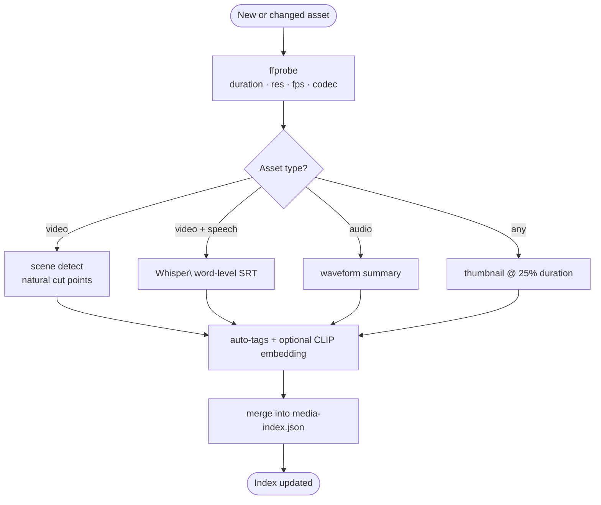

### Retrieval (Cursor-style relevancy)

When the user says *"use something calmer for the middle"*:

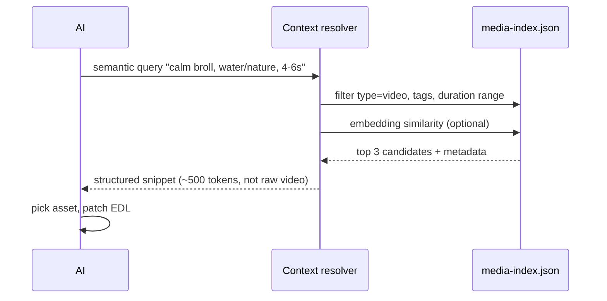

**Never in context:** raw video bytes · full ffprobe dump for 200 library files · entire transcript when editing one clip.

---

## 9. Plan layer — EDL & storyboard

### Purpose tags (editorial constraints)

Every clip in the video lane **must** have a purpose. Clips without purpose fail validation.

| Tag | Rule | Typical duration |
|-----|------|------------------|
| `hook` | First 1–3s; must land before 2s on social | 1–3s |
| `problem` | Pain point | 2–5s |
| `solution` | Product / demo | 3–6s |
| `proof` | Stats, testimonials | 2–4s |
| `broll` | Mood, texture — no critical info | 2–6s |
| `cta` | Final call to action | 2–5s |

### Pacing rules (encoded in skills + validator)

| Rule | Enforcement |
|------|-------------|
| Hook within 2s | Validator checks first `hook` clip end time |
| One idea per shot | Skill guidance + storyboard structure |
| J-cut / L-cut | EDL audio lane offset vs video cut |
| Music ducking | `duckUnderVoDb` when VO present |
| Hard duration cap | Sum of timeline ≤ `brief.maxDurationSec` |
| Fade out on end | `music.fadeOutSec` ≥ 0.5 |

### EDL timeline visualization

```
Timeline (15s TikTok, 9:16)
─────────────────────────────────────────────────────────────────
0s        3s        6s        9s        12s       15s
├─────────┼─────────┼─────────┼─────────┼─────────┤
VIDEO  │▓▓ HOOK ▓▓│░░ BROLL ░░░░░│  SOL  │░░│▓▓ CTA ▓▓▓│
       └─ crossfade ─┘           │       │           │
VO     │────── VO track ──────────────────────────────│
MUSIC  │♪♪♪♪♪♪♪♪♪♪♪♪♪♪♪♪♪♪♪♪♪♪♪♪♪♪♪♪♪♪♪♪♪♪♪♪♪♪♪♪♪♪│
       ducking ▼▼ under VO
─────────────────────────────────────────────────────────────────
Purpose: hook    broll         solution  broll  cta
```

### Storyboard format (motion route)

For HyperFrames projects, scenes are planned in `STORYBOARD.md`:

```markdown
## Scene 01 — hook (0–3s)
- Blueprint: stat-hit
- Message: "2M prayers answered"
- Transition out: fade

## Scene 02 — problem (3–7s)
- Blueprint: text-reveal
- Message: "Distraction kills focus"
- Voice: line 2 of SCRIPT.md

## Scene 03 — cta (12–15s)
- Blueprint: cta-card
- Message: "Download Prayer Lock"
```

Each scene compiles to `compositions/frames/NN-*.html` — seekable, deterministic HTML rendered frame-by-frame by HyperFrames.

### Route decision

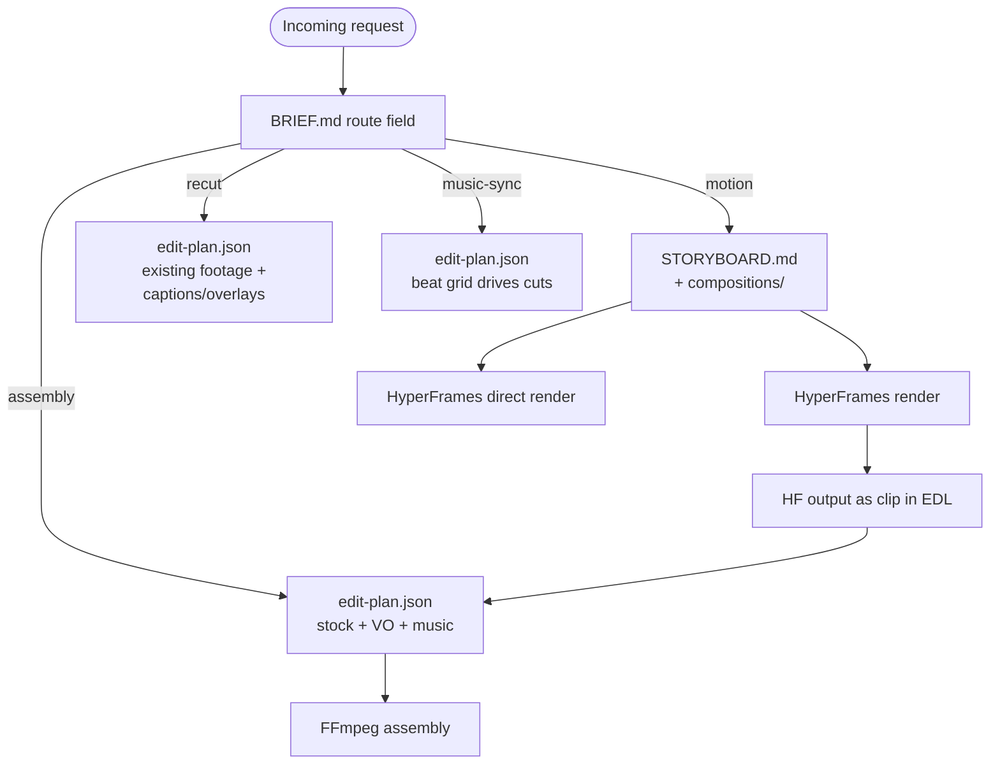

---

## 10. Validation engine

### Philosophy

Validation is **pure code** — the TypeScript equivalent of a compiler and linter. No LLM calls. Fast. Deterministic. Blocking.

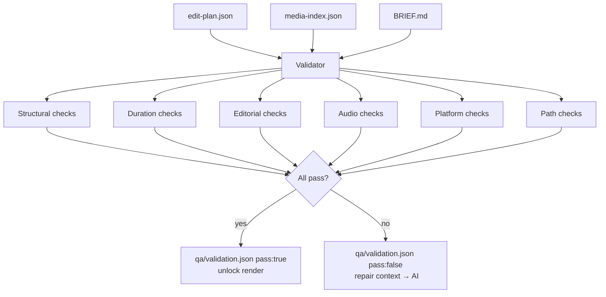

### Check catalog

| Check ID | Category | Rule |
|----------|----------|------|
| `paths-exist` | structural | Every `assetId` resolves to existing file |
| `clip-duration-valid` | structural | `out > in` for every clip |
| `source-in-bounds` | structural | `out ≤ asset.durationSec` |
| `purpose-required` | structural | Every video clip has a purpose tag |
| `duration-cap` | duration | Timeline total ≤ `brief.maxDurationSec` |
| `no-unintentional-gaps` | duration | Gaps only if explicitly marked |
| `hook-timing` | editorial | First hook ends ≤ 2s on social platforms |
| `cta-present` | editorial | At least one `cta` clip if brief requires it |
| `music-ducking` | audio | Music gain ≤ -12 dB when VO present |
| `vo-intelligibility` | audio | VO gain ≥ music gain + 12 dB |
| `aspect-match` | platform | Output matches `brief.aspect` |
| `caption-safe-zone` | platform | Captions within safe margins (if enabled) |

### Repair loop

```
Validator errors → structured repair context → Director agent → EDL patch → re-validate
```

Repair context example:

```json
{
  "repair": true,
  "errors": [
    {
      "check": "hook-timing",
      "message": "Hook ends at 2.4s — must land by 2.0s for tiktok",
      "suggestion": "Trim hook.out from 3.0 to 2.0, or increase speed"
    },
    {
      "check": "source-in-bounds",
      "message": "broll.out (6.0) exceeds stock-lake duration (5.8s)",
      "suggestion": "Set broll.out to 5.8 or pick different in-point"
    }
  ]
}
```

---

## 11. Execution layer

### Render generator

The harness reads approved `edit-plan.json` and **generates** `scripts/render.sh` — never ad-hoc commands.

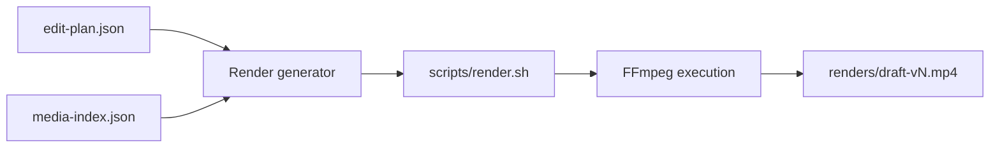

### Generator responsibilities

| Step | Implementation |
|------|----------------|
| Trim clips | `-ss` / `-t` per EDL in/out |
| Scale + crop | `scale` + `crop` to target aspect |
| Speed change | `setpts` / `atempo` per clip `speed` field |
| Concatenate | `concat` demuxer or `xfade` for transitions |
| Audio mix | `amix` with per-lane gain + ducking |
| Captions | `subtitles` filter from SRT |
| Overlays | `drawtext` or pre-rendered overlay PNGs |
| Fade out | `afade` / `fade` on final output |

### Reproducibility contract

```
Same edit-plan.json + same source assets + same generator version = same output
```

Every render command is checked into the project. Re-running `bash scripts/render.sh` reproduces the export.

### HyperFrames integration

| Step | Tool |
|------|------|
| Motion graphic / designed scene | HyperFrames composition HTML |
| Render scene | `npx hyperframes render` → `renders/video.mp4` |
| Import into assembly | EDL references HF output as a clip `assetId` |
| Avoid double-mixing | If HF render includes baked audio, omit duplicate lane in EDL |

**Rule:** Do not rebuild motion graphics inside FFmpeg. Render HTML compositions first; assemble in EDL.

### Incremental render (future optimization)

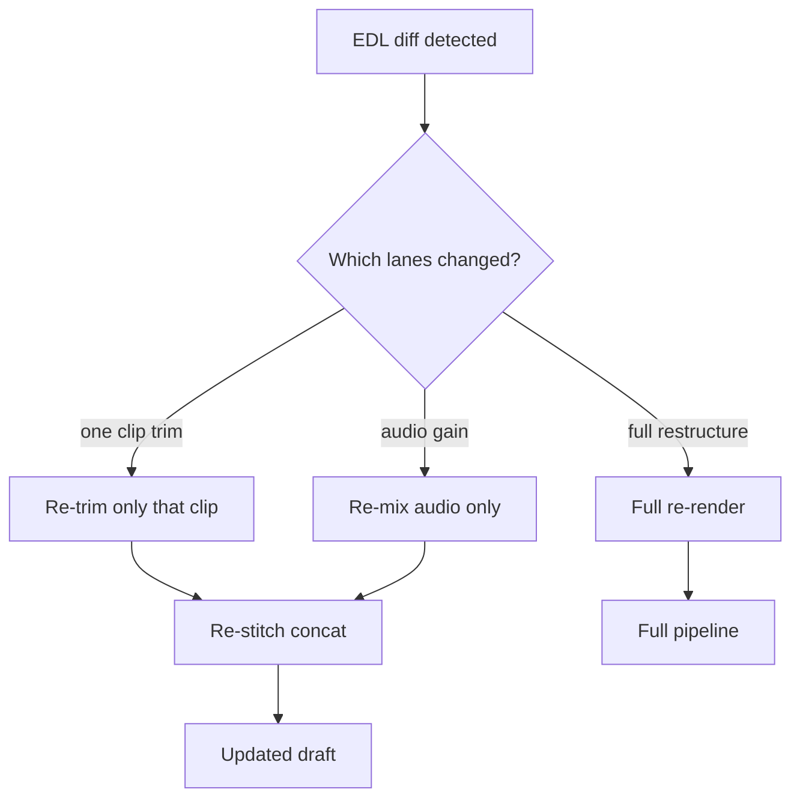

---

## 12. QA & verification

### Post-render checks

| Check | Method | Blocks delivery? |
|-------|--------|------------------|
| Output duration | ffprobe | Yes |
| Black flash at start/end | luminance on frame 0 + last | Flag |
| Caption legibility | snapshot at caption timestamps | Flag |
| Audio clipping | peak + integrated loudness | Yes |
| Hook readable at mobile size | snapshot at 1s, 2s | Flag |
| EDL ↔ output duration match | compare plan vs probe | Yes |

### Snapshot pipeline

Auto-grab frames at EDL boundaries:

```
qa/snapshots/
├── 00-hook-start.jpg       @ 0.0s
├── 01-hook-end.jpg         @ hook.out
├── 02-broll-mid.jpg        @ midpoint of broll
├── 03-cta-start.jpg        @ cta.in
├── 04-final-frame.jpg      @ duration - 0.1s
└── contact-sheet.jpg       all stitched — one-glance review
```

### Multimodal review (selective, not full-video)

At QA checkpoints, send to the model:

- Contact sheet (6–12 frames)
- Waveform + transcript alignment diagram
- 2–3 second clips around each cut point

Model feedback example: *"Cut 2 feels abrupt — add 0.3s J-cut on VO."* → EDL patch → re-validate → partial re-render.

**Not:** feeding the entire 15-minute MP4 into context.

### Human approval surface

The human sees **contact sheet + validation report**, not "please watch this video and tell me if it's good."

```
┌──────────────────────────────────────────────────────────────┐
│  QA Report — draft-v2                                        │
├──────────────────────────────────────────────────────────────┤
│  ✅ Duration: 14.2s / 15s cap                                │
│  ✅ Hook ends: 1.8s                                          │
│  ✅ Loudness: -16.1 LUFS                                     │
│  ⚠️  Caption at 4.2s near bottom safe zone edge             │
├──────────────────────────────────────────────────────────────┤
│  [hook] [broll] [solution] [cta]  ← contact sheet thumbs   │
├──────────────────────────────────────────────────────────────┤
│  [ Request changes ]              [ Approve for final ]      │
└──────────────────────────────────────────────────────────────┘
```

---

## 13. Context system

### Context tiers

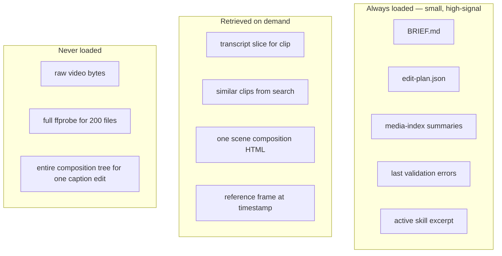

### @-mention resolver

| Mention | Resolves to |
|---------|-------------|
| `@brief` | Full BRIEF.md |
| `@plan` / `@edl` | Current edit-plan.json |
| `@clip:hook` | EDL row + asset metadata + transcript slice + thumbnail path |
| `@asset:stock-lake` | Full index entry + scene boundaries |
| `@vo` | VO lane + word timings |
| `@scene:02-problem` | Storyboard row + composition HTML path |
| `@brand` | Design tokens from Figma / brand spec |

### Resolver API (conceptual)

```typescript
interface ContextRequest {
  mention: string;           // "@clip:hook"
  projectDir: string;
  maxTokens?: number;        // budget cap
}

interface ContextSnippet {
  mention: string;
  type: "edl-row" | "asset" | "transcript" | "frame" | "brief";
  content: string;           // structured markdown or JSON
  attachments?: string[];    // thumbnail paths (for multimodal models)
  tokenEstimate: number;
}
```

Natural language references ("the lake clip") resolve through index search → same structured snippet format.

---

## 14. Agent orchestration

### Specialist roles

One general "video AI" is weaker than routed workers:

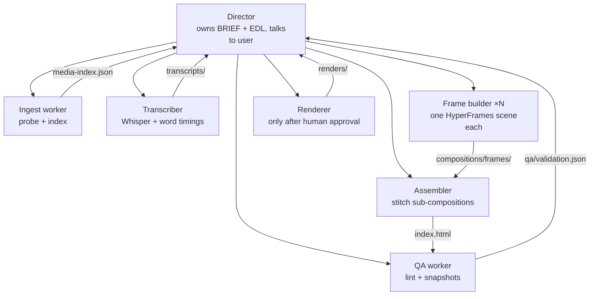

### Dispatch contract

Harness-agnostic — works with Cursor, Claude Code, Codex, or custom API:

| Verb | Meaning |
|------|---------|
| `DISPATCH(role, context)` | Start child with **full role prompt + project files on disk** — not parent chat history |
| `PARALLEL(N)` | N independent workers; no ordering; no shared state beyond filesystem |
| `WAIT(artifact)` | Completion = **expected file exists** — not harness notification |
| `REPAIR(error)` | Re-dispatch once with same prompt + repair context; then surface to user |

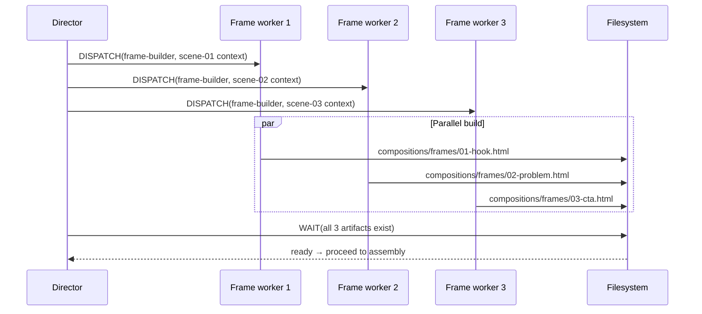

### Concurrency cap → batching

A harness concurrency limit **reduces parallelism, not scope**:

```
9 scenes, cap 3 → 3 waves of 3 workers
Never: merge scenes into one worker to fit cap
Never: drop scenes
```

---

## 15. Approval gates

### Gate map

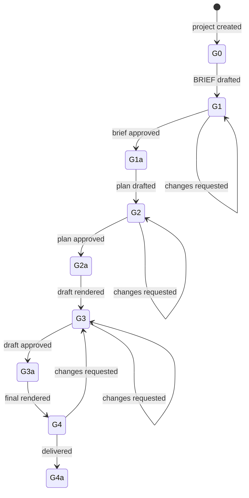

| Gate | Artifact | User sees | Blocks |
|------|----------|-----------|--------|
| **G1** Brief | `BRIEF.md` | Intent summary | Planning |
| **G2** Plan | `edit-plan.json` / storyboard | Shot table with purposes + durations | Render |
| **G3** Draft | contact sheet + validation | Keyframes + pass/fail checks | Final export |
| **G4** Final | `renders/final.mp4` | Full preview | Publish / delivery |

### Diff-based iteration

Edits after approval are **patches on the plan**, not restarts:

```
"Move broll 0.5s earlier"  →  patch EDL  →  re-validate  →  re-render
"Duck music more"          →  patch gainDb  →  re-mix audio only
"Extend hook by 0.5s"      →  patch hook.out  →  re-validate  →  re-render
```

---

## 16. Studio UI

### Wireframe

```
┌─────────────────────────────────────────────────────────────────────────┐
│  ● BRIEF ✓   ● EDL (draft)   ○ Preview   ○ QA                          │
├──────────────────┬──────────────────────────────────────────────────────┤
│  Asset browser   │  Timeline (EDL visual)                              │
│                  │  ┌── hook ──┬── broll ──┬── solution ──┬── cta ──┐  │
│  🔍 Search       │  │ 0–3s     │ 2.6–6s   │ 6–10s        │ 10–15s  │  │
│  @clip:hook      │  │ hook     │ broll    │ solution     │ cta     │  │
│  @asset:lake     │  └──────────┴──────────┴──────────────┴─────────┘  │
│                  │  ─ ─ VO lane ─────────────────────────────────────  │
│  Thumbnails      │  ♪ ♪ ♪ ♪ ♪ ♪ ♪ ♪ ♪ ♪ ♪ ♪ ♪ ♪ ♪ ♪ ♪ ♪ ♪ ♪ ♪ ♪ ♪  │
│  ┌────┐ ┌────┐   ├──────────────────────────────────────────────────────┤
│  │    │ │    │   │  Agent panel                                         │
│  └────┘ └────┘   │  > extend hook by 0.5s                               │
│                  │                                                      │
│                  │  ┌─ EDL diff ─────────────────────────────────────┐  │
│                  │  │ hook.out: 3.0 → 3.5                           │  │
│                  │  │ total duration: 14.2s → 14.7s (within cap)    │  │
│                  │  └───────────────────────────────────────────────┘  │
│                  │  [ Apply ]  [ Apply + re-render ]  [ Reject ]       │
├──────────────────┴──────────────────────────────────────────────────────┤
│  Contact sheet: [hook] [broll] [solution] [cta]                         │
│  Validation: 6/6 pass  ·  Loudness: -16.1 LUFS  ·  [ Approve G3 ]        │
└─────────────────────────────────────────────────────────────────────────┘
```

### MVP vs full Studio

| Feature | MVP (headless) | Full Studio |
|---------|----------------|-------------|
| EDL editing | JSON file + agent | Visual timeline + table |
| Approval | Manual file review | One-click gates |
| Preview | External player | In-app synced preview |
| Diff view | Git diff | Inline EDL diff panel |
| @mentions | Agent skill convention | UI autocomplete |
| Contact sheet | Folder of JPGs | Inline gallery |

**The harness works without Studio.** Studio is high-leverage UX, not a dependency.

---

## 17. Technology stack

### Language allocation

| Layer | Language | Rationale |
|-------|----------|-----------|
| Harness core | **TypeScript (Node)** | EDL validation, dispatch, CLI, HyperFrames integration |
| Studio UI | **TypeScript + React** | Rich timeline/diff UI, WebSocket preview |
| Video execution | **FFmpeg CLI** | Industry standard — don't reimplement codecs |
| Motion / captions | **HTML + CSS + JS** | HyperFrames seekable compositions |
| Heavy indexing | **Python (optional sidecar)** | Whisper, scene detect, CLIP embeddings |
| Schemas | **JSON + Zod (TS)** | Validate at boundaries |

### Dependency graph

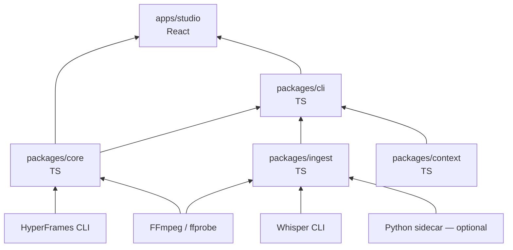

### External tools (must be on PATH)

| Tool | Purpose |
|------|---------|
| `ffmpeg` / `ffprobe` | Probe, trim, concat, mix, caption burn |
| `whisper` (or whisper.cpp) | Word-level transcription |
| `npx hyperframes` | Motion composition render (when route includes motion) |

---

## 18. Repository layout

### Harness monorepo (~28 files MVP, ~70 full product)

```
video-harness/
├── package.json
├── tsconfig.json
├── README.md
├── ARCHITECTURE.md                 ← this document
│
├── packages/
│   ├── core/                       # schemas, validate, render gen, qa
│   │   ├── src/
│   │   │   ├── schemas/
│   │   │   │   ├── brief.ts
│   │   │   │   ├── edl.ts
│   │   │   │   └── media-index.ts
│   │   │   ├── validate/
│   │   │   │   ├── edl-validator.ts
│   │   │   │   └── brief-validator.ts
│   │   │   ├── render/
│   │   │   │   └── ffmpeg-generator.ts
│   │   │   ├── qa/
│   │   │   │   ├── snapshot.ts
│   │   │   │   └── loudness.ts
│   │   │   └── index.ts
│   │   └── package.json
│   │
│   ├── ingest/                     # ffprobe, scene, transcribe, index build
│   │   ├── src/
│   │   │   ├── ffprobe.ts
│   │   │   ├── scene-detect.ts
│   │   │   ├── transcribe.ts
│   │   │   ├── build-index.ts
│   │   │   └── index.ts
│   │   └── package.json
│   │
│   ├── context/                    # @mention resolver
│   │   ├── src/
│   │   │   ├── resolver.ts
│   │   │   └── index.ts
│   │   └── package.json
│   │
│   ├── agents/                     # role files + dispatch adapter
│   │   ├── roles/
│   │   │   ├── director.md
│   │   │   ├── ingest.md
│   │   │   ├── frame-builder.md
│   │   │   └── qa.md
│   │   └── dispatch.ts
│   │
│   └── cli/
│       ├── src/
│       │   ├── commands/
│       │   │   ├── init.ts
│       │   │   ├── ingest.ts
│       │   │   ├── validate.ts
│       │   │   └── render.ts
│       │   └── index.ts
│       └── package.json
│
├── apps/
│   └── studio/                     # optional React UI
│       └── ...
│
├── skills/
│   └── video-harness/
│       └── SKILL.md                # Cursor agent skill
│
└── templates/
    ├── BRIEF.md
    └── edit-plan.json
```

### File counts

| Scope | Folders | Files |
|-------|---------|-------|
| Harness MVP | ~14 | ~28 |
| + Studio UI | +8 | +30 |
| + Agent roles | +2 | +10 |
| **Full product** | **~25–30** | **~65–75** |
| Per assembly project | ~6–8 | ~8–15 |
| Per HyperFrames project | ~10–15 | ~25–50+ |

---

## 19. Build phases

### Phase map

```mermaid
gantt
  title Harness build order
  dateFormat X
  axisFormat %s

  section Foundation
  Project scaffold           :a1, 0, 1
  Ingest pipeline            :a2, 1, 2
  EDL schema + validator     :a3, 2, 4

  section Core loop
  Render generator           :b1, 4, 6
  Snapshot QA                :b2, 6, 7
  Skills wired in            :b3, 7, 8

  section Intelligence
  Context resolver           :c1, 8, 10
  Agent dispatch             :c2, 10, 12

  section Product
  Studio UI                  :d1, 12, 18
  Incremental render         :d2, 18, 20
  Recipe / memory layer      :d3, 20, 22
```

### Phase detail

| Phase | Deliverable | Unlocks |
|-------|-------------|---------|
| **1. Scaffold** | Project templates, folder layout, CLI `init` | Consistent project structure |
| **2. Ingest** | ffprobe → `media-index.json` | AI knows what assets exist |
| **3. Validator** | EDL + brief validation, `qa/validation.json` | Compile errors before render |
| **4. Render gen** | EDL → `scripts/render.sh` → MP4 | Reproducible exports |
| **5. Snapshot QA** | Auto keyframes + contact sheet | Human review without full watch |
| **6. Skills** | Pacing rules, purpose tags, platform caps in SKILL.md | Editorial intelligence for any agent |
| **7. Context** | `@clip`, `@asset` resolver | Cursor-level relevancy |
| **8. Dispatch** | Director + worker roles | Parallel scene builds |
| **9. Studio** | EDL panel + diff + approve UI | IDE feel |
| **10. Polish** | Incremental render, recipes, multimodal cut review | Production speed + taste |

**Phases 1–6 = working strong harness (no UI).** Phases 7–10 = Cursor-grade product.

---

## 20. Integration map — HyperFrames & existing skills

### What already exists

| Harness layer | Existing stack |
|---------------|----------------|
| Intent | HyperFrames `BRIEF.md` + intent layer (`/hyperframes`) |
| Motion plan | `STORYBOARD.md` + composition HTML (`/hyperframes-core`) |
| Assembly plan | `video-editing` skill EDL schema |
| Executors | FFmpeg patterns + `npx hyperframes render` |
| Production loop | blocks → audio → frames → assembly → verify → deliver |
| Agent dispatch | `subagent-dispatch.md` harness adapter |
| Determinism | HyperFrames seekable GSAP timelines |
| Media library | `videos/`, `audio/`, `animation/` folder conventions |
| Recipes / prefs | `media-use` prefs + recipe scripts |

### Gap analysis

```mermaid
flowchart LR
  subgraph have["Already have ~70%"]
    H1[BRIEF + intent]
    H2[Storyboard + compositions]
    H3[EDL skill + examples]
    H4[FFmpeg + HyperFrames executors]
    H5[Production + review loops]
    H6[Subagent dispatch contract]
  end

  subgraph gap["Gaps to close"]
    G1[Formal media-index.json]
    G2[Code-enforced EDL validator]
    G3[Render generator from EDL]
    G4[Snapshot QA pipeline]
    G5[Context @mention resolver]
    G6[Studio UI]
  end

  have --> Product[Strong harness]
  gap --> Product
```

### Shared media library layout

```
marketing-automation/               # or workspace root
├── videos/                         # shared raw + stock footage
├── videos/edited/                  # final assembly exports
├── audio/
│   ├── music/
│   └── voiceover/
├── images/
├── design/                         # brand system
├── animation/<project>/            # HyperFrames projects
└── videos/<project>/               # standalone assembly projects
```

Project-local assets (VO, music inside a HyperFrames folder) are valid — the EDL references whichever path holds the file.

---

## 21. Strong vs weak harness

| Dimension | Weak harness | Strong harness |
|-----------|--------------|----------------|
| **Memory** | Chat history | Project files on disk |
| **Edit surface** | FFmpeg one-liners | EDL / storyboard JSON |
| **Context** | Dump everything into prompt | Index + `@` retrieval |
| **Validation** | Hope it works | Schema + rules engine |
| **Render** | Ad hoc commands | Generated script, reproducible |
| **QA** | "Does it look ok?" | Snapshots + automated checks |
| **Iteration** | Re-prompt from scratch | Diff plan, partial re-render |
| **Agents** | One general model | Routed specialists + parallel workers |
| **Human control** | After the fact | Gates on artifacts before render |
| **Resume** | Lost on new session | Any AI reads project folder |
| **Git** | Nothing to diff | Plain text plans are diffable |
| **Platform rules** | Mentioned in prompt | Encoded in validator + skills |

---

## 22. Limits & future extensions

### Known limits

| Limit | Why | Mitigation |
|-------|-----|------------|
| Aesthetic "feel" | JSON plans encode rules, not taste | Multimodal review at cut points; human G3 gate |
| Long-form narrative arc | 30+ min rhythm is editorial craft | Segment into acts; human director role |
| Real-time scrubbing | Batch-compile model, not NLE | Studio preview player; not live GPU timeline |
| Pure generative footage | Harness composes existing material | Integrate gen clips as indexed assets |
| Music "breathing" | Hard to encode in JSON | Waveform-aware suggestions; human ear at G3 |

### Future extensions (priority order)

1. **Semantic media index** — CLIP embeddings, natural-language asset search
2. **Incremental render** — re-stitch only changed segments
3. **Multimodal cut review** — model sees contact sheet + cut clips, suggests EDL patches
4. **Learned edit priors** — fine-tune planner on EDL + outcome pairs per platform
5. **Recipe memory** — "last TikTok ad was 9:16, 15s, this caption style" as defaults
6. **Studio UI** — timeline, diff view, `@` autocomplete, synced preview
7. **Collaboration** — branch/merge on EDL (git-native), comment threads on clips

---

## 23. Glossary

| Term | Definition |
|------|------------|
| **Harness** | The TypeScript spine that validates plans, generates renders, dispatches agents, and resolves context. Model-agnostic. |
| **EDL** | Edit Decision List — `edit-plan.json` describing lanes, clips, timing, audio, transitions, captions. |
| **Purpose tag** | Editorial label on a clip (`hook`, `broll`, `cta`, etc.) enforcing narrative structure. |
| **Media index** | `media-index.json` — machine-readable catalog of all assets with probe data, scenes, transcripts. |
| **Gate** | Human approval checkpoint (G1–G4) that blocks the pipeline until an artifact is approved. |
| **Contact sheet** | Grid of keyframe snapshots at EDL boundaries for one-glance visual review. |
| **Repair context** | Structured validation errors fed back to the AI for EDL fixes. |
| **Route** | Workflow type: `assembly`, `motion`, `recut`, `music-sync`. |
| **Dispatch** | Starting a specialist agent worker with a role file + project context. |
| **Deterministic render** | Same plan + same assets + same generator = same output. No randomness at render time. |
| **Partial re-render** | Re-compiling only changed segments instead of full export. |
| **HyperFrames** | HTML-based video composition framework — seekable timelines, frame-accurate render. |
| **Studio** | Optional React UI providing timeline, diff, preview, and approval gates. |

---

## Summary

```
┌─────────────────────────────────────────────────────────────────────────┐
│                                                                         │
│   Intent (BRIEF)  →  Index (media)  →  Plan (EDL)  →  Validate         │
│        →  Execute (FFmpeg/HF)  →  Verify (snapshots)  →  Gate        │
│        →  Diff  →  (loop)                                               │
│                                                                         │
│   AI edits plans.  Tools render pixels.  Humans approve artifacts.      │
│                                                                         │
└─────────────────────────────────────────────────────────────────────────┘
```

**Video harness = Cursor for video editing.**

The architecture is strongest when the model never touches raw pixels — only structured, validatable, diffable plans — and deterministic tools compile those plans into output with automated QA and human gates at every meaningful checkpoint.

---

*Document version: 1.0 · 2026-07-21*
